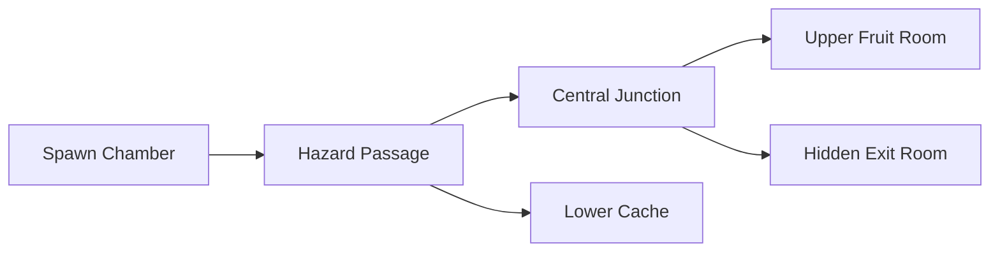

# Level 3: The Long Way Round

## Purpose

Introduce exploration across multiple camera rooms. The exit is not visible from spawn, and the player must remember an unexplored branch after collecting fruit elsewhere.

## Topology



## Room Grid

```text
+--------------------+--------------------+--------------------+
| Upper Fruit Room   | Central Junction   | Hidden Exit Room   |
+--------------------+--------------------+--------------------+
| Spawn Chamber      | Hazard Passage     | Lower Cache        |
+--------------------+--------------------+--------------------+
```

## Progression

1. Spawn with no exit in view.
2. Cross the first hazard passage and discover the central junction.
3. Explore left for upper fruit and down/right for the lower cache.
4. Return to the junction and travel right to the hidden exit.
5. The exit opens only after all fruit is collected.

## Camera

Each room is `24x11` tiles. Every room connection is two tiles wide. Entering a new room pans the camera to that room and holds a stable puzzle frame until Flobby crosses another room boundary.
